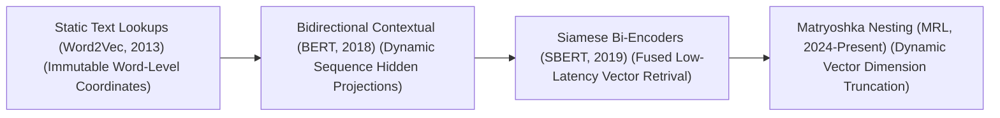
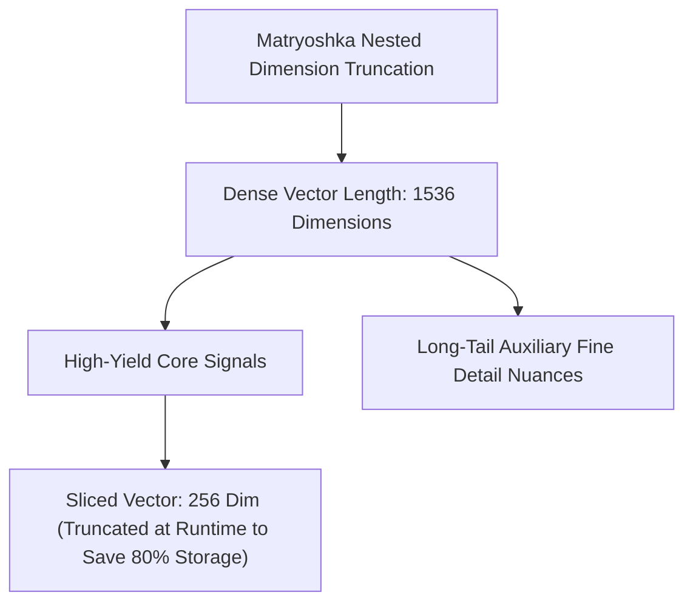

# 🚀 Awesome-Embedding-Models

  
  

## 🧠 Embedding Models in AI: History, Progression, Variants, & Applications

An **Embedding Model** is a specialized foundational artificial intelligence architecture designed to map discrete, high-dimensional categorical data (such as textual phrases, complete source code repositories, visual patches, or user tracking vectors) into low-dimensional, continuous dense vector spaces [INDEX: 1, 10]. Unlike early machine learning pipelines that relied on rigid, sparse representations like One-Hot Encoding or TF-IDF—which scaled poorly and treated all words as orthogonally independent—embedding models compress attributes into deep semantic manifolds [INDEX: 18]. 

By projecting discrete tokens or chunks into high-dimensional geometric coordinates, these models allow machines to calculate mathematical distance vectors (such as Cosine Similarity) to determine relative semantic affinity [INDEX: 18]. This enables real-time information retrieval, clustering, and open-vocabulary cross-modal alignments across modern foundational AI ecosystems [INDEX: 4, 10].

---

## ⏳ 1. The Macro Chronological Evolution

The technical framework governing text and multimodal representation has transitioned from static, non-contextual vector lookups to bidirectional attentional networks, multi-task instruction-guided systems, and modern hyper-compressed nested manifolds.

| Era / Model | Year First Used | Paper Link | Description |
| :--- | :--- | :--- | :--- |
| [**The Static Word-Level Lookup Era (Word2Vec / GloVe)**](docs/word2vec-glove.md) | 2013 | [Mikolov, T., et al.](#references) | **Concept:** The historical baseline that sparked the continuous representation boom. Mikolov et al. proved that continuous vector directions could capture abstract human meaning natively by training shallow networks on local contextual windows. It yielded global lookup tables where geometric offsets replicated algebraic logic (e.g., $\overrightarrow{\text{king}} - \overrightarrow{\text{man}} + \overrightarrow{\text{woman}} \approx \overrightarrow{\text{queen}}$).  **Limitation:** Rigidly non-contextual. A word was permanently locked to exactly *one* spatial coordinate vector, completely failing to resolve polysemy (e.g., mapping the word `bank` to the identical coordinate whether it meant a financial vault or a river edge). |
| [**The Bidirectional Contextual Projection Era (BERT / ELMo)**](docs/bert-elmo.md) | 2018 | [Devlin, J., et al.](#references) | **Concept:** Solved the polysemy bottleneck by shifting embedding extraction from hardcoded lookup rows to dynamic hidden state projections [INDEX: 1]. While the model still utilizes a static embedding table as its step zero entry gate, the vector is instantly passed through deep **Self-Attention blocks** [INDEX: 1].  **Significance:** The output embedding for a token is dynamically computed as a function of the *entire surrounding sequence*, allowing the hidden layer coordinates to shift dynamically based on local semantic context [INDEX: 1]. |
| [**The Siamese Bi-Encoder Revolution (Sentence-BERT / SBERT)**](docs/sbert.md) | 2019 | [Reimers, N., & Gurevych, I.](#references) | **Concept:** Resolved the immense execution latency of early multi-pass Transformer architectures. To check document similarity, early BERT models required passing a concatenated text pair through full attention layers, which was too slow for search engine infrastructures. SBERT paired twin, identical models inside a **Siamese Network configuration**, optimizing cosine similarity directly over text pairs via contrastive learning [INDEX: 18].  **Significance:** Dropped semantic search time over 10 million sentences from 65 hours down to **less than 5 milliseconds**, standardizing real-world production vector database architectures [INDEX: 18]. |
| [**The Multi-Task Instruction & Matryoshka Nesting Era**](docs/multi-task-mrl.md) | 2024 | [Wang, L., et al.](#references) | **Concept:** The current modern state-of-the-art production baseline. It merges massive multi-billion parameter autoregressive language model backbones (e.g., using Mistral/Llama variants via architectures like NV-Embed or BGE-M3) with [**Matryoshka Representation Learning (MRL)**](docs/mrl.md) [INDEX: 11, 18]. Models are fine-tuned via **Instruction-Tuned Embeddings**, using task prompt prefixes to shape the vector density dynamically based on the exact deployment goal (e.g., retrieval vs. clustering) [INDEX: 18]. |

---

## 🏗️ 2. Core Architectural & Model Variants

Embedding models are strictly categorized based on how parameters are cross-referenced, pooled, and structured during downstream similarity evaluations [INDEX: 18].

| Variant | Year First Used | Paper Link | Description |
| :--- | :--- | :--- | :--- |
| [**Bi-Encoder Models (Dual-Tower Matching)**](docs/bi-encoder.md) | 2019 | [Reimers, N., & Gurevych, I.](#references) | **Mechanism:** Projects sentence A and sentence B through completely separate, parallel text encoders independently, generating two isolated embedding vectors [INDEX: 18]. Semantic similarity is calculated instantly as a low-cost vector dot product or cosine coordinate check [INDEX: 18].  **Pros:** Highly scalable; embeddings can be calculated once offline, saved to a vector database, and searched via low-latency index lookups [INDEX: 18]. |
| [**Cross-Encoder Models (Full-Attention Fusion)**](docs/cross-encoder.md) | 2018 | [Devlin, J., et al.](#references) | **Mechanism:** Concatenates both text inputs into a single, unified string interleaved with a structural separator token (`Sentence A [SEP] Sentence B`) and feeds it to the Transformer in a single forward pass [INDEX: 18].  **Pros:** Achieves maximal semantic precision because full cross-attention calculations occur between every word in both sentences simultaneously [INDEX: 18].  **Cons:** Incredibly latent; computationally unviable for first-stage database lookups because checking a new query requires executing a full deep-network pass against *every single document row* individually [INDEX: 18]. |
| [**Dense vs. Sparse Embedding Models**](docs/dense-vs-sparse.md) | 2013 | [Mikolov, T., et al.](#references) | **Mechanism:** Dense models map strings to continuous multi-dimensional floats (e.g., a 1536-dimension array capturing abstract meanings) [INDEX: 18]. Sparse embedding models (like SPLADE) map sentences directly to vocabulary token frequencies, producing an uncompressed, sparse vector containing mostly zeros [INDEX: 18].  **Pros:** Sparse layouts offer exceptional exact-keyword matching resolution (essential for searching product serial numbers or legal codes), while dense profiles excel at cross-phrasing abstract concepts [INDEX: 18]. |

---

## 📉 3. High-Capacity Dimension Scaling & MRL Losses

To deploy massive embedding vectors across resource-constrained edge systems or high-throughput vector databases, modern engineering frameworks implement nested scaling constraints [INDEX: 18].

| Scaling & MRL Losses | Year First Used | Paper Link | Description |
| :--- | :--- | :--- | :--- |
| [**Matryoshka Representation Learning (MRL)**](docs/mrl.md) | 2022 | [Kusupati, A., et al.](#references) | **The Math:** An advanced loss paradigm that nests information hierarchically [INDEX: 18]. It forces the optimizer to pack the absolute most critical semantic signals into the *earliest coordinates* of the vector stream during contrastive pre-training [INDEX: 18].  **Significance:** Unlocks **Adaptive Vector Truncation** [INDEX: 18]. Developers can cleanly slice an embedding from 1536 dimensions down to 256 dimensions at runtime, saving up to 80% on vector database storage footprints while maintaining 98%+ of the baseline retrieval accuracy [INDEX: 18]. |
| [**Cross-Modal Joint-Embeddings (CLIP / SigLIP)**](docs/clip-siglip.md) | 2021 | [Radford, A., et al.](#references) | **The Math:** Maps diverse modalities into a single shared coordinate sphere [INDEX: 10]. It pairs an input with an alternative view or another modality (e.g., an image matched with its text caption), applying contrastive loss functions to maximize the vector dot product of matched pairs while aggressively repelling mismatched pairs [INDEX: 4, 10]. |

---

## ⚙️ 4. Production Engineering Challenges & Hardware Solutions

Deploying high-volume embedding models into commercial enterprise stacks introduces intense memory allocation caps and operational bottlenecks [INDEX: 18].

| Challenge / Solution | Year First Used | Paper Link | Description |
| :--- | :--- | :--- | :--- |
| [**The Long-Document Information Dilution (The Squashing Effect)**](docs/long-document.md) | N/A | N/A | **The Problem:** Forcing a model to compress a 10,000-word financial filing or long text block into a single 768-dimension floating-point vector results in massive information compression loss, blurring out minor localized data numbers [INDEX: 18].  **Mitigation:** Implementing **Hierarchical Parent-Child Chunking**, slicing long documents into tiny, 200-token child shards for precise dense vector indexing, while passing the broader parent chunk back to the generator during inference passes [INDEX: 18]. |
| [**The Distributed Vector Indexing Memory Wall**](docs/distributed-indexing.md) | N/A | N/A | **The Problem:** Storing millions of uncompressed dense vectors across large-scale vector indices forces servers to execute exhaustive pairwise distance matrices ($O(N^2)$ space complexity), which rapidly saturates system RAM and creates heavy retrieval latencies [INDEX: 4].  **Mitigation:** Implementing **Approximate Nearest Neighbors (ANN) vector indexing** (such as Hierarchical Navigable Small World - HNSW or IVF graphs), quantizing continuous vectors down to execute billions of distance checks inside GPU SRAM registers instantly [INDEX: 4]. |

---

## 🌍 5. Frontier Real-World AI Industrial Applications

| Application | Year First Used | Paper Link | Description |
| :--- | :--- | :--- | :--- |
| [**Enterprise Retrieval-Augmented Generation (RAG Infrastructure)**](docs/enterprise-rag.md) | 2020 | N/A | **Application:** Serves as the critical baseline entry tier powering corporate AI knowledge retrieval [INDEX: 18]. Incoming customer queries are tokenized and mapped via embedding models into dense vector coordinates, triggering fast vector database index lookups (e.g., Pinecone, Qdrant, Milvus) to fetch exact matching context rows instantly [INDEX: 18]. |
| [**Open-Vocabulary E-Commerce Product Catalog Ingestion**](docs/ecommerce-catalog.md) | 2021 | [Radford, A., et al.](#references) | **Application:** Processes millions of incoming multi-modal merchant inventory listings daily [INDEX: 4]. Rather than writing manual text categorization rules, listing graphics and descriptions pass through CLIP image-text encoders [INDEX: 4]. Contrastive embedding models group the resulting vectors automatically, sorting products into semantically coherent, dynamic taxonomy branches on-the-fly [INDEX: 4]. |
| [**Automated Corporate E-Discovery & Legal Audit Reranking**](docs/corporate-ediscovery.md) | N/A | N/A | **Application:** Processes millions of unstructured legal contracts and municipal litigation histories [INDEX: 18]. Multi-Task Cross-Encoders scan document pools, evaluating complex legal logic vectors and semantic liabilities across decades of corporate text lines with human-grade verification accuracy [INDEX: 18]. |

---

## 📚 References
1. Mikolov, T., et al. (2013). Distributed representations of words and phrases and their compositionality. *Advances in Neural Information Processing Systems (NeurIPS)*, 26, 3111-3119 [INDEX: 18].
2. Devlin, J., et al. (2018). BERT: Pre-training of deep bidirectional transformers for language understanding. *arXiv preprint arXiv:1810.04805* [INDEX: 1, 18].
3. Reimers, N., & Gurevych, I. (2019). Sentence-BERT: Sentence embeddings using Siamese BERT-networks. *Proceedings of the 2019 Conference on Empirical Methods in Natural Language Processing (EMNLP)*, 3982-3992 [INDEX: 18].
4. Radford, A., et al. (2021). Learning transferable visual models from natural language supervision. *International Conference on Machine Learning (ICML)*, 8748-8763 [INDEX: 10, 18].
5. Kusupati, A., et al. (2022). Matryoshka representation learning. *Advances in Neural Information Processing Systems (NeurIPS)*, 35, 30233-30248 [INDEX: 18].
6. Wang, L., et al. (2024). Multi-task instruction fine-tuning for large-scale language model sentence embeddings. *International Conference on Learning Representations (ICLR)* [INDEX: 18].

---

To advance this documentation repository, structural setup, or vector deployment pipeline, consider exploring these adjacent development pathways:
* Build a **Python code snippet using PyTorch and the Sentence-Transformers library** illustrating how to load a pre-trained bi-encoder model, calculate dense spatial vectors for a local list of phrases, and evaluate a cosine similarity score matrix [INDEX: 18].
* Generate a **comprehensive Markdown table** explicitly comparing Average Word2Vec, Static Lookups, Bidirectional Contextual Encodings (BERT), Siamese Bi-Encoders, Cross-Encoders, and Matryoshka Nested Embeddings across mathematical spatial granularities, computational memory/compute limits, training data volume dependencies, and down-stream zero-shot agility [INDEX: 18].
* Establish a **performance verification suite using Triton** to track the exact computational token-per-second throughput and memory bus latency metrics achieved when compiling a fused Matryoshka truncation operation patch directly inside single-pass GPU memory registers [INDEX: 18].

***

**Follow-Up Options Matrix:**

Before updating this workspace setup, let me know how you would like to proceed by choosing one of the options below:
* I can provide a **complete Python code boilerplate using PyTorch** demonstrating how to write an automated script that calculates an exact Multiple Negatives Ranking Loss (MNRL) contrastive loop over dual tensor strings [INDEX: 18].
* I can generate a **Markdown matrix table** tracking the explicit vector dimensions, context boundaries, and structural pooling layers of the leading open-weight embedding models [INDEX: 18].
* I can write a detailed technical explanation focusing on **how to configure Reciprocal Rank Fusion (RRF) algorithms** to merge sparse BM25 scores with dense semantic vectors smoothly at runtime [INDEX: 18].

##  Star History

<a href="https://www.star-history.com/?repos=ishandutta2007%2FAwesome-Embedding-Models&type=date&legend=bottom-right">
<picture>
<source media="(prefers-color-scheme: dark)" srcset="https://api.star-history.com/chartrepos=ishandutta2007/Awesome-Embedding-Models&type=date&theme=dark&legend=bottom-right" />
<source media="(prefers-color-scheme: light)" srcset="https://api.star-history.com/chartrepos=ishandutta2007/Awesome-Embedding-Models&type=date&legend=bottom-right" />

</picture>
</a>

