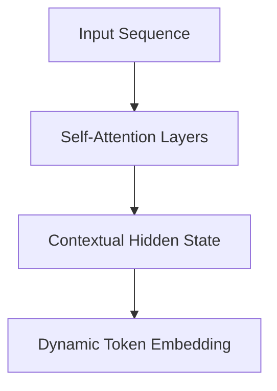

# The Bidirectional Contextual Projection Era (BERT / ELMo)

## Overview
This era (~2018-2021) introduced dynamic, context-aware embeddings, solving the polysemy bottleneck of static embeddings.

## Key Diagram

## Detailed Information
Models like BERT process the entire surrounding sequence to compute an embedding for a specific token dynamically. The same word (e.g., 'bank') will have a different vector depending on whether the surrounding words discuss finance or nature.
