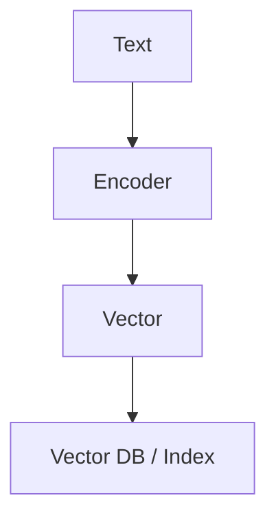

# Bi-Encoder Models (Dual-Tower Matching)

## Overview
A scalable architecture where texts are embedded independently.

## Key Diagram

## Detailed Information
Bi-Encoders generate vectors instantly and are highly scalable because vectors can be calculated offline and searched via approximate nearest neighbor (ANN) indexes.
