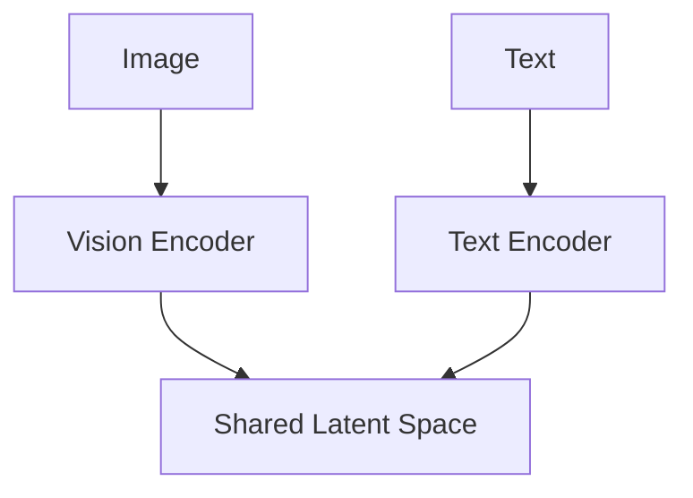

# Cross-Modal Joint-Embeddings (CLIP / SigLIP)

## Overview
Models designed to map diverse modalities (like images and text) into a shared coordinate space.

## Key Diagram

## Detailed Information
CLIP uses contrastive loss to pull matching image-text pairs close together and push mismatched pairs apart, revolutionizing open-vocabulary visual search.
