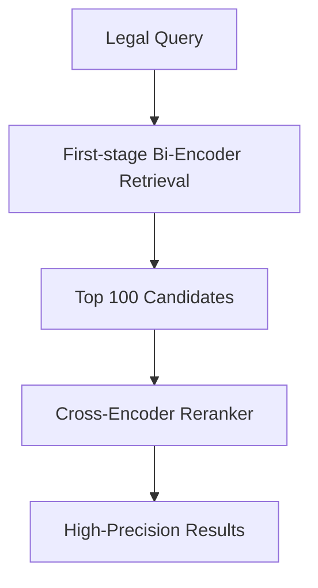

# Automated Corporate E-Discovery

## Overview
Using embedding models to process millions of unstructured legal contracts for litigation histories.

## Key Diagram

## Detailed Information
Multi-Task Cross-Encoders evaluate complex legal liabilities with human-grade verification accuracy.
