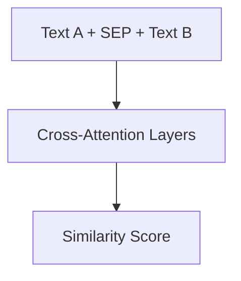

# Cross-Encoder Models (Full-Attention Fusion)

## Overview
An architecture that concatenates two texts for maximum semantic precision.

## Key Diagram

## Detailed Information
Unlike Bi-Encoders, Cross-Encoders calculate full attention between every word in both texts. While they are highly accurate, they are computationally unviable for large-scale database lookups and are usually reserved for late-stage reranking.
