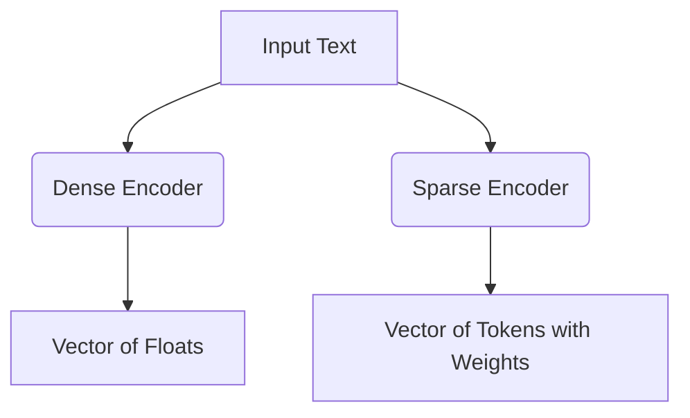

# Dense vs. Sparse Embedding Models

## Overview
A comparison between high-dimensional continuous arrays (Dense) and uncompressed token frequency arrays (Sparse).

## Key Diagram

## Detailed Information
Sparse models like SPLADE provide precise keyword-matching resolution, while Dense models excel at abstract cross-phrasing. Modern hybrid search systems often fuse both using Reciprocal Rank Fusion (RRF).
