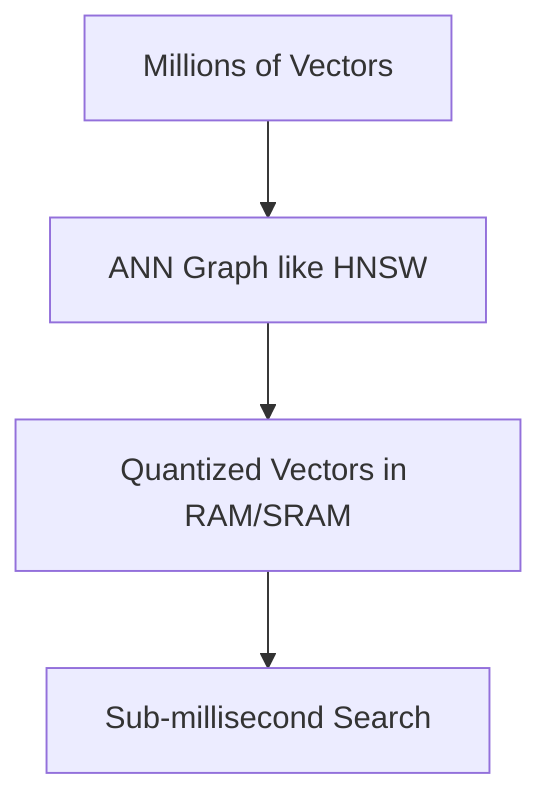

# The Distributed Vector Indexing Memory Wall

## Overview
The issue of RAM saturation when storing and executing exhaustive distance matrices for millions of uncompressed dense vectors.

## Key Diagram

## Detailed Information
Modern vector databases mitigate this by using Approximate Nearest Neighbors (ANN) and quantization to execute billions of distance checks rapidly.
