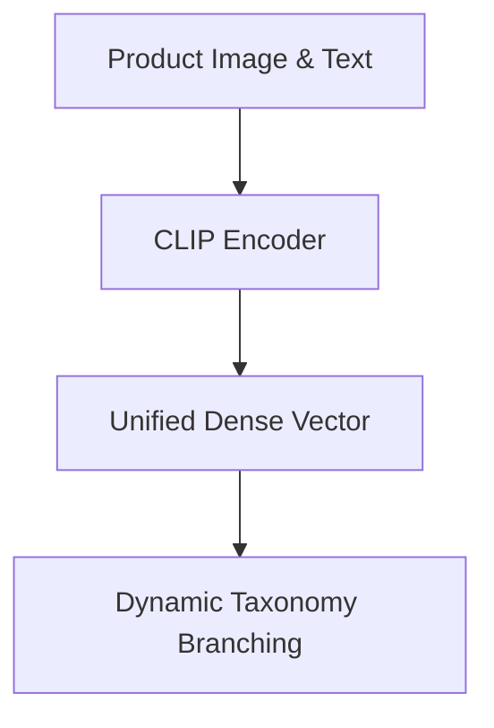

# E-Commerce Product Catalog Ingestion

## Overview
Processing and sorting multi-modal merchant inventory listings without manual rules.

## Key Diagram

## Detailed Information
Automates product sorting and visual search functionalities in huge multi-vendor marketplaces.
