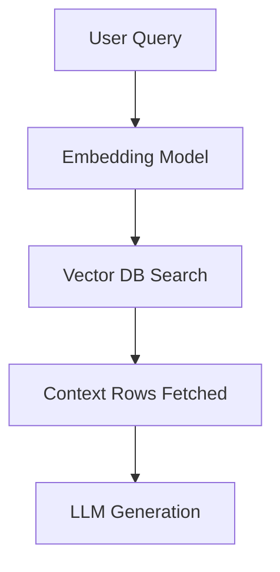

# Enterprise Retrieval-Augmented Generation

## Overview
The architecture powering corporate AI knowledge retrieval using vector databases.

## Key Diagram

## Detailed Information
RAG maps queries into dense coordinates, looking up precise matching context in databases like Pinecone, Milvus, or Qdrant.
