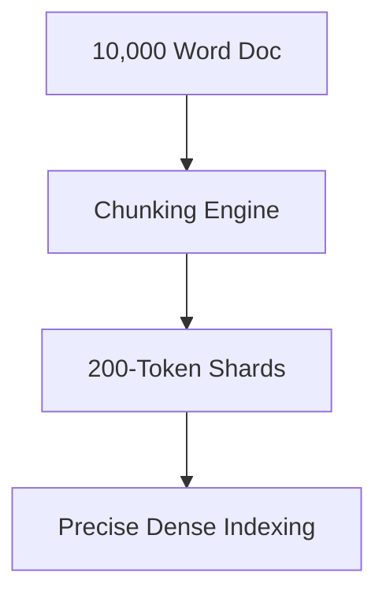

# The Long-Document Information Dilution

## Overview
A major challenge where compressing a huge text block into a single vector results in information loss.

## Key Diagram

## Detailed Information
Mitigated by Hierarchical Parent-Child Chunking, which allows small shards to provide precision indexing while retrieving the broader parent context during inference.
