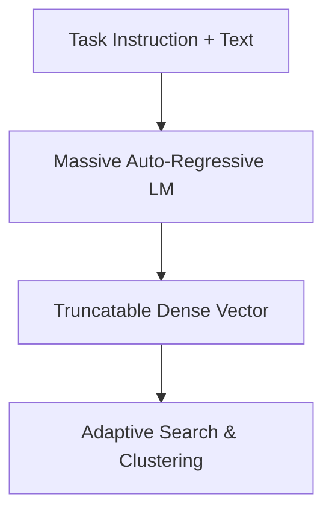

# The Multi-Task Instruction & Matryoshka Nesting Era

## Overview
This current era (2024-Present) merges massive parameter language models with instruction fine-tuning and Matryoshka representation learning.

## Key Diagram

## Detailed Information
By prepending task prompts (e.g., 'Represent this text for retrieval'), modern embeddings shape the vector density on the fly. Paired with MRL, these vectors can be cleanly sliced to save storage footprints while preserving accuracy.
