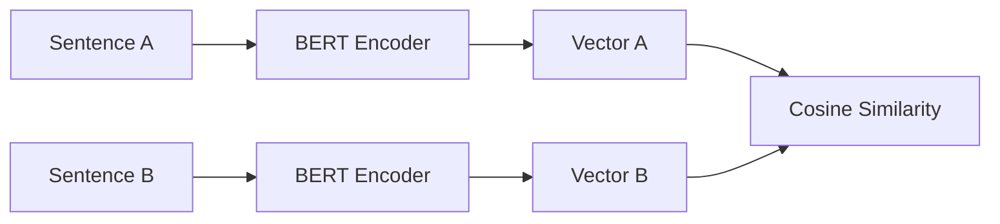

# The Siamese Bi-Encoder Revolution (Sentence-BERT / SBERT)

## Overview
SBERT (2019-2023) revolutionized document retrieval by introducing Siamese Network configurations for fast cosine similarity scoring.

## Key Diagram

## Detailed Information
Before SBERT, computing the similarity of two sentences required passing both through a single BERT model, causing massive latency. Bi-Encoders map sentences to vectors independently, dropping search time from hours to milliseconds.
