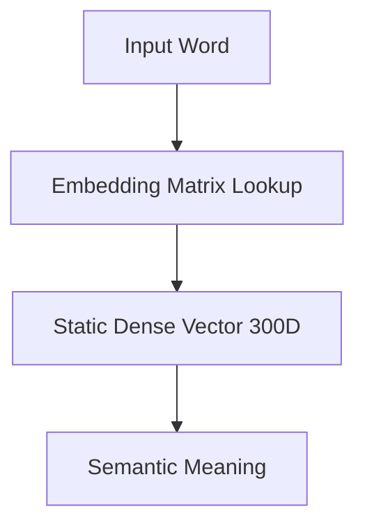

# The Static Word-Level Lookup Era (Word2Vec / GloVe)

## Overview
The Static Word-Level Lookup Era (~2013-2017) revolutionized natural language processing by mapping discrete words to dense, continuous vector spaces. Models like Word2Vec and GloVe proved that continuous vector directions could capture abstract semantic meaning.

## Key Diagram

## Detailed Information
Unlike earlier sparse representations like One-Hot Encoding, Word2Vec generated a fixed-size vector for each word. While this captured broad semantic relationships, a major limitation was polysemy—a single word (like 'bank') had only one representation, regardless of context.
